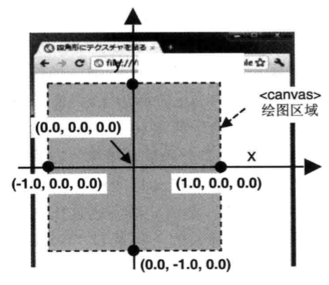

# WebGL 入门

## WebGL 辅助函数 - getWebGLContext

在获取 WebGL 绘图上下文时，`canvas.getContext()` 函数接收的参数，在不同的浏览器会有所不同，
故使用 `getWebGLContext` 来隐藏不同浏览器之间的差异。

## 设置 canvas 背景色 - clearColor

获取 WebGL 绘图上下文后，使用 `clearColor` 来设置背景色，用背景色清空 `canvas` 绘图区域。
**在清空绘图区域之前也得指定背景颜色**

```bash
gl.clearColor(red, blue, green, alpha)

// 如背景色被指定为黑色
gl.clearColor(0.0, 0.0, 0.0, 1.0) 
```

在二维图形中，颜色分量值在 0～255 之间。由于 WebGL 继承自 OpenGL，颜色分量值的取值范围遵循 OpenGL 的取值，区间为 0.0～1.0。

## 清空 canvas - clear

`gl.clear(gl.COLOR_BUFFER_BIT)` **清空绘图区域，实际是清空颜色缓存区(color buffer)**

**gl.clear 参数**

| buffer  | 说明 | 相关函数 |
| ------------- | ------------- | ------------- |
| gl.COLOR_BUFFER_BIT  | 颜色缓存区  | gl.clearColor() |
| gl.DEPTH_BUFFER_BIT  | 深度缓冲区  | gl.clearDepth() |
| gl.STENCIL_BUFFER_BIT  | 模版缓冲区  | gl.clearStencil() |

默认参数 gl.clearColor(0.0, 0.0, 0.0, 0.0), gl.clearDepth(1.0), gl.clearStencil(0)

## 着色器是什么

**WebGL 依赖着色器(Shader)的绘图机制，来绘制二维/三维的图形**

WebGL 需要两种着色器: 顶点着色器和片元着色器

### 顶点着色器(Vertex Shader)

描述顶点特性(如位置、颜色等)的程序。顶点(Vertex)是指二维/三维空间中的一个点，比如二维/三维图形的端点或者交点。

### 片元着色器(Fragment Shader)

进行逐片元处理过程如光照的程序。片元(Fragment)是一个 WebGL 术语，可以理解为像素(图像中的单元)。

**程序执行流程**
1.浏览器加载 JS。
2.执行 WebGL 相关方法。
3.逐顶点操作、逐片元操作。
4.渲染到颜色缓冲区 => 显示。

### GLSL ES

**GLSL ES 是一种强类型的编程语言。**

| 类型  | 说明 |
| ------------- | ------------- |
| float  | 浮点类型  | 
| vec4  | 4个浮点数组成的矢量(x, y, z, w) |

**齐次坐标** 齐次坐标(x, y, z, w)等价于三维坐标(x/w, y/w, z/w), w=1 即可表示为三维坐标。

## drawArrays

一个强大的函数，用于绘制各种图形。

| 参数  | 说明 |
| ------------- | ------------- |
| mode | 指定绘制的方式：gl.POINTS、gl.LINES、gl.LINE_STRIP、gl.LINE_LOOP、gl.TRIANGLES、gl.TRIANGLE_STRIP、gl.TRIANGLE_FAN |
| first | 指定从哪个顶点开始绘制(整数型) |
| count | 指定绘制需要多少个顶点(整数型) |
| 返回值 | 无 |
| 错误 | INVALID_ENUM: 传入的参数 mode 不是指定参数类型。INVALID_VALUE: 参数 first、count 为负数 |

## WebGL 坐标系统

三维坐标系统(笛卡尔坐标系)，具有 X 轴、Y 轴、 Z 轴。参见书籍66页。
在 WebGL 中，面向计算机，X轴是水平的，正方向向右。Y轴是垂直的，正方向向下。Z轴是垂直于屏幕，正方向向外。

### WebGL 坐标与 canvas 坐标的对应关系

* <canvas> 的中心点 (0.0, 0.0, 0.0)
* <canvas> 的上边缘和下边缘 (-1.0, 0.0, 0.0) 和 (1.0, 0.0, 0.0)
* <canvas> 的左边缘和右边缘 (0.0, -1.0, 0.0) 和 (0.0, 1.0, 0.0)



## JavaScript 与着色器之间传输数据

### attribute 变量与 uniform 变量

attribute 变量传输的是那些与顶点相关的数据。**变量都以 a_ 开头**
uniform 变量传输的是那些对于所有顶点都相同的(与顶点无关)数据。**变量都以 u_ 开头**

attribute 方法

1. gl.getAttribLocation(program, name) 函数获取 attribute 变量的存储地址
2. gl.vertexAttrib3f(locaiton, v1, v2, v3) 函数向 attribute 变量赋值

